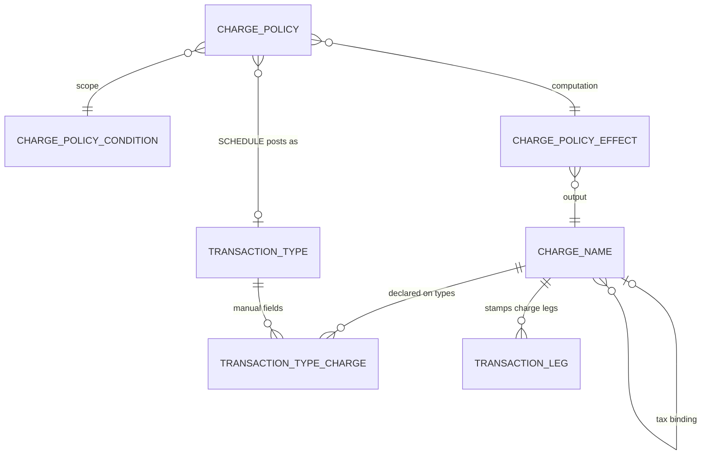

# Charges Module (frais)

What ProFin charges **in response** to events — commissions, fees, and the TCA they
generate. This module is **configuration only**: a catalog of charge names, the manual
fields each transaction type declares, and the tariff policies. It owns **no instance
tables** — a posted charge lives in the ledger as auto-generated
[TransactionLeg](../transactions/TransactionLeg.md) rows stamped `chargeNameId`. The
ledger stays the single computable source.

Why no charge-amount table: [TransactionAmount](../transactions/TransactionAmount.md)
exists because witnesses ≠ movements. A charge has no such gap — **a charge is always
exactly its movement** — so a stored charge figure would duplicate its legs: a banned
derivable.

## The pieces

```
ChargeName               -- the catalog: vocabulary, tax binding, rounding
ChargePolicy             -- the tariffs: trigger + condition + effect
  ├── conditionId → ChargePolicyCondition   -- named, reusable scope
  └── effectId    → ChargePolicyEffect      -- named, reusable: base + calc → output name
```

Two pieces live in the **transactions** domain, with the entities they belong to:
[TransactionTypeCharge](../transactions/TransactionTypeCharge.md) (which names a type
declares — part of the type's declaration surface, beside contract lines and
eligibility) and `TransactionLeg.chargeNameId` (posted truth — one nullable FK,
nothing else).

## The principles

- **Two sources, strictly separate, additive.** Declared fields
  ([TransactionTypeCharge](../transactions/TransactionTypeCharge.md)) are the operator's deliberate
  charges and ride the entry transaction; [policies](ChargePolicy.md) are the house
  tariffs. Neither touches the other; both firing on one event is two charges, by
  intent. An empty field = no legs = no charge, no tax — **absence is the waiver**.
- **Charge legs are automatic, never authored.** One `CARRY` leg per charge value: −
  on the settlement book of the transaction's portfolio (the book itself when it
  self-settles), in that book's declared cash instrument
  (`Portfolio.cashInstrumentId`) — the same resolution every cash leg uses — stamped
  with the name ([TransactionLeg](../transactions/TransactionLeg.md)). No house-side
  leg and no Σ = 0 requirement — the ledger is per-book truth; the receiving side
  (revenue, TCA payable) is the Accounting module's product at the GL, bound by
  charge name.
- **Tax follows the service.** A name's `taxChargeNameId` binding derives the tax in
  the same transaction — no tax policy, no tax field, no tax on tax
  ([ChargeName](ChargeName.md)).
- **Charge analysis reads the charge legs** (`chargeNameId IS NOT NULL`), grouped by
  name. Provenance and idempotency of scheduled charge transactions use the header's
  emitter mechanism (`sourceSystem` + `externalId`).

The posting sequence and end-to-end traces live with the workflows (`worflow/`), not
here.

## Relationships



## Shared envelope

Every entity carries the standard envelope — see the
[transactions README](../transactions/README.md#shared-envelope). Configuration rows
here are ordinary mutable data (retirement = `isActive = false`); posted charges are
legs and follow the ledger's append-only law.
