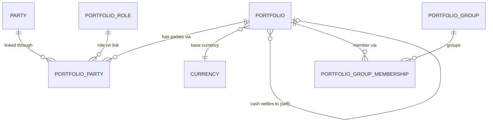

# Portfolio Domain

The portfolio domain models the **account** — the container that holds securities and
cash for one or more parties, in a base currency, under a mandate. It is the **aggregate
root** of the platform: positions, valuations, transactions, fees, and statements all
attach to a portfolio. Nothing about an investor's holdings exists without one.

## The four entities

- **[Portfolio](Portfolio.md)** — the account itself: its currency, mandate, lifecycle
  state, and (for investment accounts) the cash account that settles it.
- **[PortfolioParty](PortfolioParty.md)** — the link between an account and the people on
  it (owner, advisor, beneficiary…), each with a role. Many-to-many: an account can have
  several parties, a party can hold several accounts.
- **[PortfolioRole](PortfolioRole.md)** — the catalog of roles a party can play on an
  account (Owner, Advisor, Beneficiary…). It gives meaning to each link.
- **[PortfolioGroup](PortfolioGroup.md)** — categorization buckets (account type, segment,
  pension scheme, reporting cohort) a portfolio belongs to via a membership link.

## How they correlate

**Portfolio is the root, and parties never attach to it directly.** The relationship is
always carried by a **PortfolioParty** link, which names the **PortfolioRole** that party
plays there. Because the role lives on the link and not on the party, the same person can
be an Owner on one account and an Advisor on another. Joint ownership is simply several
active links on one portfolio.

**An account settles through another account.** An `INVESTMENT` portfolio points — via
`cashSettlementPortfolioId`, a self-reference — at the `CASH` portfolio that holds its
money. A cash portfolio points at nothing: it *is* the settlement destination, holding the
client's cash-HTG and cash-USD positions. (The standard client shape is three portfolios:
investment HTG, investment USD, and one cash account they both settle to.)

**An account is categorized through PortfolioGroup membership** — one portfolio can sit in
many groups at once (an account type, a segment, a reporting cohort). Grouping is kept at
the portfolio level on purpose, so a single client's accounts can be categorized
independently.

## Boundary — what's here, and what isn't

This domain owns the account, its parties, and its categorization. Nothing more.

- **Who a party is** — a person or company, its identity and KYC — lives on the **Party**
  record, not here. PortfolioParty records only the *relationship*.
- **Tax and fees** live in the **taxation layer**. The portfolio carries no tax flags; a
  transaction tax keyed on a portfolio's group is resolved there.
- **Positions, balances, and valuations** are **derived** from the transaction ledger —
  never stored on the portfolio.
- **Transactions** are their own model. A portfolio only *holds* them by reference.

## Relationships

## Shared envelope

Every entity in this domain carries the same control and integration fields. Where a spec
says *+ envelope*, it means these:

| Field | Type | Description |
|-------|------|-------------|
| `isActive` | bool | Soft on/off. Records are retained for audit and history — never hard-deleted. |
| `externalId` | string | This record's identifier in an external system, for integration and cross-system reconciliation. |
| `externalRef` | string? | Reference to a related record in an external system. |
| `createdAt` | datetime | Creation timestamp. |
| `createdBy` | FK→User | Who created the record. |
| `modifiedAt` | datetime | Last modification timestamp. |
| `modifiedBy` | FK→User | Who last modified the record. |
