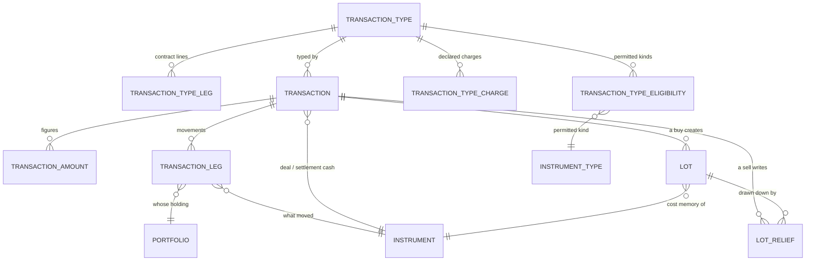

# Transaction Domain

This is the **core of the platform**. Every transaction — a purchase, a coupon, a
deposit, a fund redemption — is recorded here, and every other module (instruments,
charges, position, corporate actions, funds) implements its transactions on top of it.
It is the **financial abstraction of a transaction**: not "a bond coupon" or "an FX
deal" specifically, but the shared shape all of them reduce to. Get this layer right and
everything above it becomes simple; the modules only have to say _what_ happened, and
this domain knows how to record it.

## What an investment platform must answer

The whole design exists to answer, accurately and at any moment, a small set of
questions about a portfolio:

- **What does it hold, and what is it worth** — its positions and their value.
- **How is it performing** — its return over time.
- **What did it cost** — cost analysis on its holdings.
- **What was it charged** — charge analysis.
- **What has it earned or lost** — the client's P&L, both **realized** (from things
  actually sold) and **unrealized** (gains sitting in things still held).
  A system is only as good as its ability to answer these cheaply, correctly, and years
  later without recomputation. That requirement is what shapes the tables below.

## Why lots come first

Most of those questions come back to one thing: **cost**. You can't state a gain
without knowing what was paid; you can't value what's held without knowing its basis.
So the foundation is the **lot** — a record, for each portfolio × instrument, of what
was bought and what it cost.

Once every acquisition is a lot and every disposal draws down lots, the hard questions
become easy:

- **Realized P&L** = sum of what disposals actually earned (frozen the moment they
  happened).
- **Unrealized P&L** = what's still held, at today's price, minus what it cost.
- **Cost analysis** = read the open lots.
  Building on lots also buys a **free choice of cost-basis method**. "Which shares did I
  sell first?" (FIFO, average cost, …) becomes a strategy for _walking_ the lots, not a
  change to the data. The lots stay the same; only the walk differs. So the method is a
  setting, not a rewrite.

## The layers

The domain is split into layers, each answering a different question. A transaction
flows through them in order:

**1. Transaction** — _the event._ One row per economic event: which type, which
portfolio, the deal's inputs (quantity, price, and so on), the date, who entered it.
This is the event's identity — the header everything else hangs off.

**2. TransactionAmount** — _the anatomy of the event._ The specific figures the event
breaks into — principal, accrued interest, gross income, withholding — computed once and
frozen. This is what charge policies and accounting later read, each by name. It answers
_what were the pieces of this event._

**3. TransactionLeg** — _what actually moved._ The signed movements: shares in here,
cash out there. Positions and P&L are built from legs and nothing else. It answers _what
does each portfolio now hold._

**4. Lot → LotRelief** — _the cost memory._ A buy writes a **Lot** (quantity and cost,
remembered). A sell writes **LotRelief** rows — the realized P&L, frozen where it
happened. Together they answer _at what cost, and what was earned._

After these four, the transaction is complete and permanent. A fifth step — updating the
running position snapshot — happens in the **Position module**, called after posting.
That module lives separately; it _reads_ the lots and legs recorded here to produce
live positions and performance, but it owns none of this data.

**In one line:** the event is recorded (Transaction), broken into its figures
(TransactionAmount), turned into movements (TransactionLeg), and settled against the cost
memory (Lot / LotRelief) — then the Position module reads all of that to answer the
portfolio's questions.

## The flow of a transaction, briefly

When a transaction is posted, it runs through the layers in order — everything below
happens as one atomic step, so either all of it lands or none of it does:

1. **Record the event.** A **Transaction** row is created from the type and the
   operator's inputs (quantity, price, dates…). It goes through approval first; only
   once approved does the rest run.
2. **Compute the figures.** The engine works out each amount the type declares —
   principal, accrued, gross, withholding — and writes them as **TransactionAmount**
   rows. Simple figures come from the inputs directly; instrument-specific ones (a bond's
   coupon, the BRH index spread) are computed by the instrument itself.
3. **Generate the movements.** The type's contract says which **TransactionLeg** rows to
   create — which portfolios, which instruments, in or out — and each leg takes its value
   from one of the figures above.
4. **Settle against the cost memory.** Each leg does one thing to the lots: a buy writes
   a new **Lot**; a sell draws down lots oldest-first and writes **LotRelief** rows with
   the realized P&L; a transfer or split re-cuts lots into child lots; income and cash
   touch no lot at all.
5. **Update the position.** After the transaction is permanent, the **Position module**
   is notified to refresh the portfolio's live position — but that happens in that
   module, reading what was just recorded here.
   So the tables work together as a chain: the header names the event, the amounts break it
   into figures, the legs move value between portfolios, and the lots remember the cost so
   P&L can be answered. Steps 2–4 are the same generic engine for every transaction type;
   the only thing that changes per instrument is how its specific figures are computed. The
   detailed step-by-step — validations, reversals, the disposal walk in full — lives in a
   dedicated workflow document.

## Two boundaries worth stating

> **The event's own pieces live here; charge configuration lives in the Charges
> module.** Principal, accrued, and tax withheld at source are part of the transaction.
> Commissions and fees — what ProFin charges _in response_ — are configured in the
> Charges module (catalog, declared fields, tariff policies) and materialize **here**,
> as auto-generated charge legs stamped `chargeNameId`; a posted charge is ledger truth
> like any other movement.
>
> **This domain holds no accounting balances.** The general ledger is produced from
> these records by the Accounting module and sent to Zoho Books; Zoho holds the
> balances, not the platform.

## Where things live

- **Charges** (fees, commissions, taxes on services) → configured in the Charges
  module; posted charges live here, as auto-generated `chargeNameId` legs.
- **Positions, valuation, performance** → the Position module, which reads legs and lots.
- **General ledger export** → the Accounting module, which reads these records and writes
  to Zoho.
- **Approval** (maker/checker) → the Approval module, which every transaction passes
  through before it becomes permanent.
- **Portfolios, instruments, parties, bank accounts** → their own domains. A leg reaches
  each of them through its foreign keys.
  The individual table docs cover fields and columns. A separate workflow document will
  cover the step-by-step posting, approval, and reversal sequences.

## Relationships

## Shared envelope

Every entity carries the same control and integration fields. Where a spec says
_+ envelope_, it means:

| Field         | Type     | Description                                                                                                                                                                                                                                                          |
| ------------- | -------- | -------------------------------------------------------------------------------------------------------------------------------------------------------------------------------------------------------------------------------------------------------------------- |
| `isActive`    | bool     | Soft on/off. On the permanent records (a posted Transaction, TransactionAmount, TransactionLeg, Lot, LotRelief) it is fixed to `true` — these rows are never deleted, only reversed, because a deleted movement would make "position = the sum of movements" untrue. |
| `externalId`  | string   | This record's id in an external system — the Axia id at migration, and part of the retry key for modules that emit transactions.                                                                                                                                     |
| `externalRef` | string?  | A reference to a related external record — a wire reference, a Raymond James confirmation number.                                                                                                                                                                    |
| `createdAt`   | datetime | When the record was created.                                                                                                                                                                                                                                         |
| `createdBy`   | FK→User  | Who created it (the maker; emitting modules identify themselves here).                                                                                                                                                                                               |
| `modifiedAt`  | datetime | Last change. Stays empty on the permanent records — they are written once.                                                                                                                                                                                           |
| `modifiedBy`  | FK→User  | Who last changed it. Same rule.                                                                                                                                                                                                                                      |
