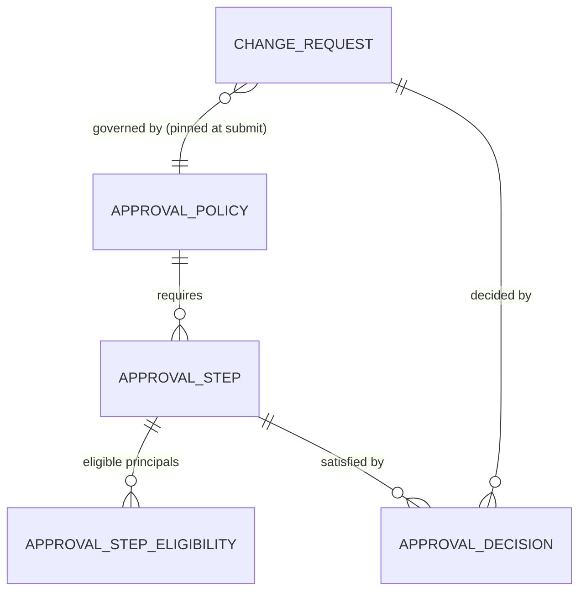
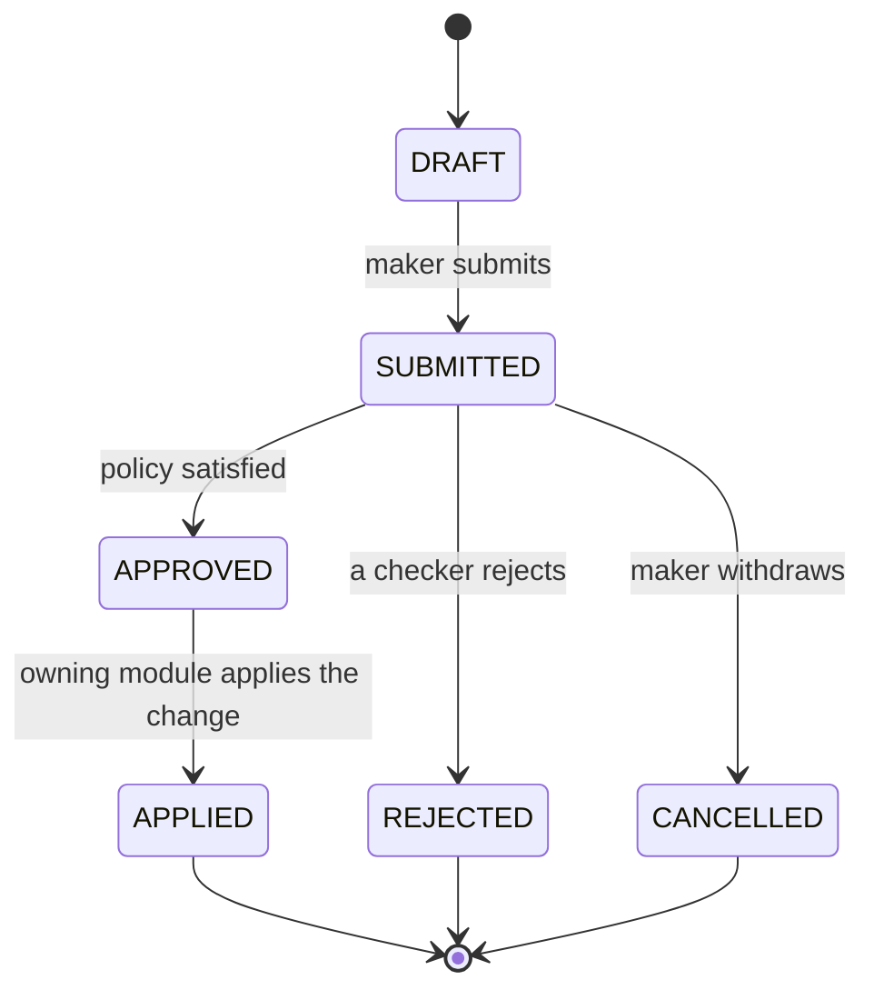

# Maker-Checker cluster Model Reference (`approbation`)

A generic **approval gate**: before a sensitive change is written, it is proposed by one user (the
_maker_) and approved by one or more others (the _checkers_). This module owns that flow for the
**whole platform**. It gates creating an instrument, editing a portfolio, deactivating a client or
posting a transaction with the same five tables, and it switches on or off per flow **by data, never
by code**.

It achieves that by knowing nothing about what it gates. The module manages **change requests to an
opaque target**: a `targetType` string, a `targetId` string, and a `payload` json it never opens. The
owning module knows what the change means and how to write it; this module owns _who approves, in what
order, and whether it is allowed_. That split is exactly what lets one mechanism wrap every flow.

The requirements this model implements are stated in [requirements.md](requirements.md).

> **The invariant that ties everything together: a change has _no effect_ on the system until it
> reaches `APPLIED`.** The pending instrument is not an instrument; the pending transaction moves no
> position. Approval is the _decision_; application is the _effect_, performed by the owning module —
> and that is also the moment a transaction is inserted and starts counting.

## Models

| Model | Purpose |
| --- | --- |
| [ChangeRequest](ChangeRequest.md) | The unit of approval — one proposed change to an opaque target |
| [ApprovalPolicy](ApprovalPolicy.md) | The configuration: which flow is gated, banded by payload threshold |
| [ApprovalStep](ApprovalStep.md) | One requirement within a policy — _how many approvers_ (1:many) |
| [ApprovalStepEligibility](ApprovalStepEligibility.md) | _Which approvers_ — role, group or user (1:many) |
| [ApprovalDecision](ApprovalDecision.md) | The record of each act — the module's only state |

## The pieces

```
ApprovalPolicy           -- the gate: (targetType, operation) + threshold band + mode
  └── ApprovalStep       -- how many approvers, in what order
        └── ApprovalStepEligibility   -- which approvers (ROLE | GROUP | USER)

ChangeRequest            -- the opaque proposal, pinned to the policy that governs it
  └── ApprovalDecision   -- one row per checker, per step
```

## Relationships



Everything outside the box is a **soft reference**, never a FK: `ChangeRequest.targetType` /
`targetId` name an entity this module cannot import, and `ApprovalStepEligibility.principalId` names a
role, group or user resolved through the identity lookup. The two genuine FKs to the security layer —
`ChangeRequest.makerId` and `ApprovalDecision.approverId` — point at `User`, which lives in the same
foundational tier.

## Lifecycle
 


`APPROVED` is a state one rarely observes at rest: the decision that satisfies the last step, the flip
to `APPLIED`, and the applier's domain writes commit in **one database transaction**. It exists so
that an applier failure leaves an approved-but-unapplied request to retry, rather than a silently lost
decision.

## Activation — switching it on per flow

A flow is under maker-checker **if and only if an active [policy](ApprovalPolicy.md) exists for its
`(targetType, operation)`.**

- Configure a policy for `(instrument, CREATE)` → creating instruments now needs approval.
- No active policy for `(instrument, UPDATE)` → updates pass straight through, applied immediately,
  with no request row written at all.
- A policy with **zero steps** = "logged but auto-approved" — the trail without the gate.

Every gated write path calls `submit_change(...)` unconditionally; the module decides gate-or-pass on
whether a policy is present. When several policies match, banding selects among them: the active
policy whose `[thresholdMin, thresholdMax)` band contains the payload's `thresholdField` value. Bands
may not overlap, and at most one policy per pair may be unbanded — both are enforced at authoring.

## Rules the module enforces

Checked at decision time against the request's **pinned** policy, not the current configuration:

- **Separation of duties** — the maker can never be an approver on their own request. Absolute, not
  configurable.
- **Eligibility** — an approver only counts toward a step they are eligible for (by role / group / user).
- **Once per step** — an approver counts at most once toward a given step.
- **N-eyes** — if a step's `distinctApprover` is set, the same person cannot satisfy two steps of the
  request.
- **Order** — under `SEQUENTIAL`, a step accepts decisions only once every lower `orderIndex` step is
  satisfied.
- **Rejection** — the `rejectionsToReject`-th rejection (default: the first) makes the request
  terminal. The maker raises a new one.
- **Upstream permission** — submitting at all requires permission to propose the change; that
  authorization is RBAC's concern, _upstream_ of this module.

## What is computed, never stored

Whether a step — and the whole request — is satisfied is **computed** from the
[decisions](ApprovalDecision.md) against the pinned policy's [steps](ApprovalStep.md). There is no
per-request step-state table, no `currentStep`, no approval counter. A stored satisfaction is a banned
derivable and the first thing to drift out of step with its decisions.

Two things *are* pinned, deliberately, and for opposite reasons:

- **The policy is pinned at submit** (`ChangeRequest.policyId`). Approvals accumulate against it; a
  request that collected two of three approvals must keep being judged against the three-step policy
  even if an admin edits the configuration mid-flight. This is why gate configuration carries no
  `effectiveFrom` / `effectiveTo` — unlike [ChargePolicy](../../Cœur%20investissement/charges/ChargePolicy.md),
  which is reconstructed from validity dates precisely because nothing accumulates against it.
- **Eligibility is *not* pinned.** It is resolved at each decision, because it tracks who is currently
  entitled to act. Decisions already recorded stand: a decision is frozen truth about the moment it was
  made.

## The seam — the only things it touches

The module integrates through exactly three contracts, and imports nothing entity-specific:

1. **An applier interface**, implemented and **registered** by each owning module, looked up by
   `targetType` at apply time:
   - `validate(payload)` — is the proposed change well-formed? (Run at submit *and* at apply.)
   - `apply(payload) → id` — perform the actual write; return the affected entity id, which a `CREATE`
     request stamps into its `targetId`.
   - `render(payload)` — present the change in the owning module's own language, so a checker can see
     what they are approving.
2. **Identity** — a thin lookup resolving a user's roles and groups for eligibility checks.
3. **Lifecycle events** — `submitted` / `approved` / `rejected`, which notifications and audit
   subscribe to. This module sends no mail and writes no domain rows.

The applier registry is the dependency inversion that keeps the arrow one-way: domain modules register
their appliers; `approbation` never imports a domain entity.

## Enums (local to this module)

- `Operation` — `CREATE | UPDATE | DEACTIVATE | POST` (on ChangeRequest, ApprovalPolicy). Extending it
  with a module-specific verb is a new enum value; the module gains no knowledge of what it means.
- `RequestState` — `DRAFT | SUBMITTED | APPROVED | APPLIED | REJECTED | CANCELLED` (on ChangeRequest).
- `PolicyMode` — `SEQUENTIAL | PARALLEL` (on ApprovalPolicy).
- `PrincipalType` — `ROLE | GROUP | USER` (on ApprovalStepEligibility).
- `Decision` — `APPROVE | REJECT` (on ApprovalDecision).

## Reference FKs (→ référentiel / other clusters)

None. The module carries no reference-data foreign key: no currency, no country, no calendar. Its only
FKs leave the cluster for `User` (security layer, same foundational tier); everything else — the
target, the principal — is a soft reference. `thresholdMin` / `thresholdMax` are bare decimals with no
currency, because they band a payload key, not a money amount.

## Shared envelope

Every table carries the standard platform envelope:

```
isActive, externalId, externalRef, createdAt, createdBy, modifiedAt, modifiedBy
```

It is read two different ways, following the [transactions](../../Cœur%20investissement/transactions/README.md#shared-envelope)
convention:

- **[ApprovalPolicy](ApprovalPolicy.md), [ApprovalStep](ApprovalStep.md) and
  [ApprovalStepEligibility](ApprovalStepEligibility.md)** are ordinary mutable configuration:
  retirement is `isActive = false`, never a delete. `ApprovalPolicy.isActive` is load-bearing — it is
  the gate switch itself.
- **[ChangeRequest](ChangeRequest.md) and [ApprovalDecision](ApprovalDecision.md)** are permanent,
  audit-grade records under BRH 10-year retention: `isActive` is fixed `true`, rows are never deleted,
  and `modifiedAt` / `modifiedBy` stay null. A request is retired through its `state`, a decision not
  at all.

## Where it lives

Its **own module** (`approbation`), in the foundational tier beside identity and audit — **depended on
by** the domain modules, depending on **none** of them.

It shares the **core database**. Approval and application happen in one transaction: on the final
approval the applier writes the domain rows and the request flips to `APPLIED`, atomically, all or
nothing. That atomicity is the reason it is an in-process module and not a separate service.
