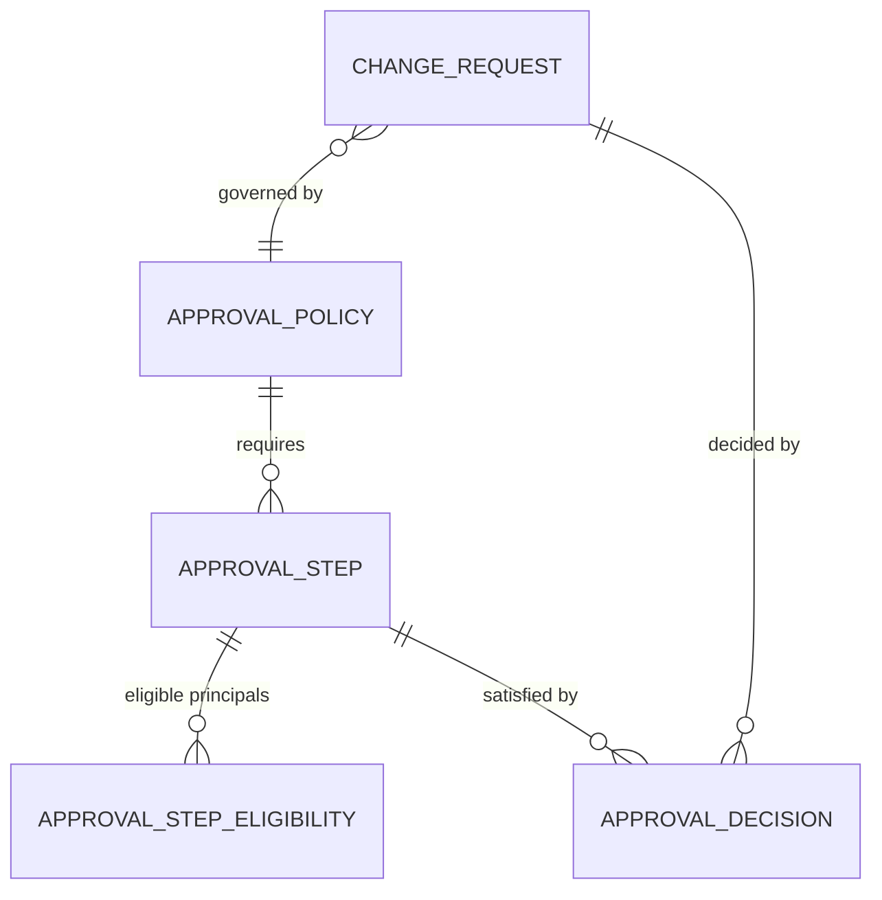
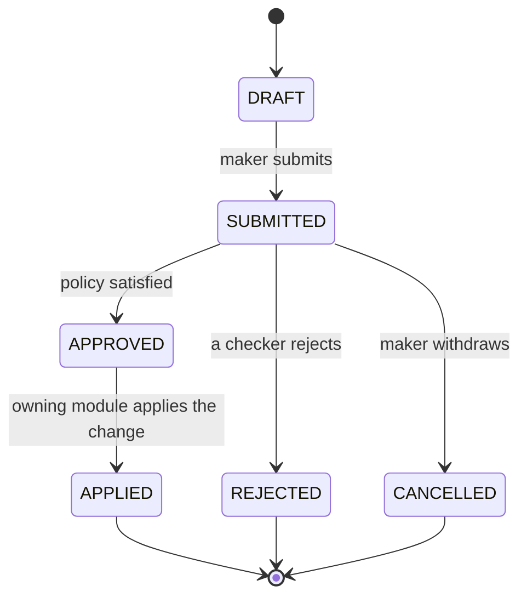

# Maker-Checker (`approbation` module)

A generic **approval gate**: before a sensitive change is written, it must be proposed by one
user (the _maker_) and approved by one or more others (the _checkers_). This module owns that
flow for the **whole platform** — it is not specific to any entity. The same mechanism gates
creating an instrument, editing a portfolio, deactivating a client, or posting a transaction,
and it can be switched on or off per flow without touching code.

Two requirements shape the entire design:

1. **It applies to any entity.** The module never imports or knows about Instrument, Portfolio,
   Client, etc. It works on _proposed changes to an opaque target_.
2. **It activates and deactivates per flow.** Whether a given operation needs approval is pure
   configuration — driven by data, not by code changes.

## Core principle — it does not know what it is gating

The module manages **change requests**, not entities. A maker submits: _"I want to
`{create | update | deactivate}` `{this kind of thing}` — here is the proposed data."_ The
module then:

1. parks that change in a pending state,
2. selects the approval policy that applies to it,
3. records each checker's decision,
4. and **only once the policy is satisfied** hands the change back to the owning module to
   _apply_ it.

The owning module is the only thing that knows how to actually write the instrument or the
portfolio. **The module owns _who approves, in what order, and whether it is allowed_; the owning
module owns _what the change means and how to write it_.** That split is exactly what lets one
mechanism wrap every flow.

## Example model

Four entities. Each also carries the shared platform envelope:
`isActive, externalId, externalRef, createdAt, createdBy, modifiedAt, modifiedBy`. The change
request and decision records are audit-grade — BRH 10-year retention applies.

### ChangeRequest — the unit of approval

| Field         | Type              | Req | Description                                                                                                                      |
| ------------- | ----------------- | --- | -------------------------------------------------------------------------------------------------------------------------------- |
| `id`          | uuid              | ●   | Surrogate primary key.                                                                                                           |
| `targetType`  | string            | ●   | What kind of entity the change is about (`portfolio`, `instrument`, `client`, `transaction`…). A plain identifier, **not** a FK. |
| `targetId`    | string            | ○   | The id of the existing entity being changed. `NULL` for a create. Not a FK — the module does not know the target's table.        |
| `operation`   | enum              | ●   | `CREATE \| UPDATE \| DEACTIVATE` (or a module-specific verb such as `POST`).                                                     |
| `payload`     | json              | ●   | The proposed change — **opaque** to the module. The owning module serializes it on submit and reads it on apply.                 |
| `policyId`    | FK→ApprovalPolicy | ●   | The policy resolved for this change.                                                                                             |
| `state`       | enum              | ●   | `DRAFT \| SUBMITTED \| APPROVED \| APPLIED \| REJECTED \| CANCELLED`.                                                            |
| `makerId`     | FK→User           | ●   | Who proposed the change.                                                                                                         |
| `submittedAt` | datetime          | ○   | When it entered `SUBMITTED`.                                                                                                     |
| `resolvedAt`  | datetime          | ○   | When it reached `APPLIED` / `REJECTED` / `CANCELLED`.                                                                            |
| + envelope    |                   | ●   | Shared platform envelope.                                                                                                        |

### ApprovalPolicy — the configuration ("how many / which")

| Field                           | Type    | Req | Description                                                                                    |
| ------------------------------- | ------- | --- | ---------------------------------------------------------------------------------------------- |
| `id`                            | uuid    | ●   | Surrogate primary key.                                                                         |
| `targetType`                    | string  | ●   | Which entity kind this policy governs.                                                         |
| `operation`                     | enum    | ●   | Which operation it governs.                                                                    |
| `mode`                          | enum    | ●   | `SEQUENTIAL` (steps in order) or `PARALLEL` (all steps open at once).                          |
| `thresholdField`                | string  | ○   | Optional: a field of the payload to band on (e.g. `amount`).                                   |
| `thresholdMin` / `thresholdMax` | decimal | ○   | Optional: the band this policy applies to — lets a large transaction select a stricter policy. |
| `isActive`                      | bool    | ●   | Whether this policy is in force (see **Activation**).                                          |
| + envelope                      |         | ●   | Shared platform envelope.                                                                      |

A policy has one or more **ApprovalStep** children.

### ApprovalStep — one requirement within a policy

| Field              | Type              | Req | Description                                                                             |
| ------------------ | ----------------- | --- | --------------------------------------------------------------------------------------- |
| `id`               | uuid              | ●   | Surrogate primary key.                                                                  |
| `policyId`         | FK→ApprovalPolicy | ●   | The policy this step belongs to.                                                        |
| `orderIndex`       | int               | ●   | Position in the chain (used when the policy is `SEQUENTIAL`).                           |
| `requiredCount`    | int               | ●   | How many approvals are needed from this step's eligible set — **_how many approvers_**. |
| `distinctApprover` | bool              | ●   | If true, whoever satisfies this step may not also satisfy another step (true N-eyes).   |
| + envelope         |                   | ●   | Shared platform envelope.                                                               |

The **eligible approver set** — **_which approvers_** — is best a small child table:
`ApprovalStepEligibility (stepId, principalType: ROLE \| GROUP \| USER, principalId)`, so one step
can list a role, a group, and/or specific users.

### ApprovalDecision — the record of each act

| Field             | Type             | Req | Description                                |
| ----------------- | ---------------- | --- | ------------------------------------------ |
| `id`              | uuid             | ●   | Surrogate primary key.                     |
| `changeRequestId` | FK→ChangeRequest | ●   | The request being decided.                 |
| `stepId`          | FK→ApprovalStep  | ●   | Which requirement this decision satisfies. |
| `approverId`      | FK→User          | ●   | Who decided.                               |
| `decision`        | enum             | ●   | `APPROVE \| REJECT`.                       |
| `comment`         | string           | ○   | Optional note.                             |
| `decidedAt`       | datetime         | ●   | When.                                      |
| + envelope        |                  | ●   | Shared platform envelope.                  |

Whether a step — and the whole request — is satisfied is **computed** from the decisions against
the policy's steps. No separate per-request step-state table is needed.

## Lifecycle

**The invariant that ties everything together: a change has _no effect_ on the system until it
reaches `APPLIED`.** The pending instrument is not an instrument; the pending transaction moves
no position. Approval is the _decision_; application is the _effect_, performed by the owning
module — and that is also the moment a transaction is inserted and starts counting.

## Activation — switching it on per flow

A flow is under maker-checker **if and only if an active policy exists for its
`(targetType, operation)`.**

- Configure a policy for `(instrument, CREATE)` → creating instruments now needs approval.
- No active policy for `(instrument, UPDATE)` → updates pass straight through, applied
  immediately.
- A policy with zero steps = "logged but auto-approved" — keeps the trail without the gate.

So a module is switched under or out of maker-checker **by data** — adding, deactivating, or
editing a policy — with no code change. Every gated write path calls `submit_change(...)`
unconditionally; the module decides gate-or-pass based on whether a policy is present. When
several policies match (banded by threshold), the applicable one is the active policy whose band
contains the payload's value.

## Rules the module enforces

- **Separation of duties:** the maker can never be an approver on their own request.
- **Eligibility:** an approver only counts toward a step they are eligible for (by role / group /
  user).
- **Once per step:** an approver counts at most once toward a given step.
- **N-eyes:** if a step's `distinctApprover` is set, the same person cannot satisfy two steps.
- **Rejection:** one rejection moves the request to `REJECTED` (default; configurable to "N
  rejections"). A rejected request is terminal — the maker raises a new one.
- **Upstream permission:** submitting at all requires permission to propose the change; that
  authorization is the owning module's / RBAC's concern, _upstream_ of this module.

## The seam — the only things it touches

To stay decoupled, the module integrates through exactly three contracts:

1. **An applier interface**, implemented by each owning module:
   - `validate(payload)` — is the proposed change well-formed?
   - `apply(payload) → id` — perform the actual write; return the affected entity id.
   - `render(payload)` — present the proposed change in the owning module's own language, so a
     checker can see what they are approving (the payload is opaque to this module).
2. **Identity** — a thin lookup to resolve a user's roles and groups for eligibility checks.
3. **Lifecycle events** — it emits `submitted` / `approved` / `rejected` events that notifications
   and audit subscribe to. It sends no emails and writes no domain rows itself.

Owning modules **register** their appliers; the module looks one up by `targetType` at apply
time, having imported nothing entity-specific.

## Where it lives

- Its **own module** (`approbation`), in the foundational tier beside identity and audit —
  **depended on by** the domain modules, depending on **none** of them. The applier registry is
  the inversion that keeps that dependency one-way: domain modules register their appliers;
  `approbation` never imports a domain entity.
- It shares the **core database**. Approval and application happen in **one transaction**: on the
  final approval the applier writes the domain row(s) and the request flips to `APPLIED`
  atomically — all or nothing. That atomicity is the reason it is an in-process module, not a
  separate service.
