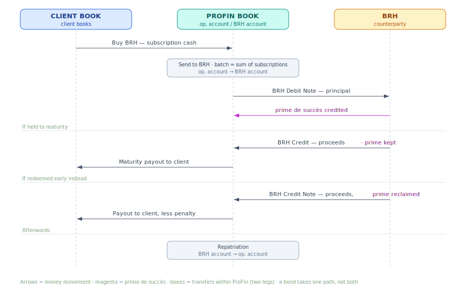

# OBL BRH — Transaction Workflows

These are the flows of money and positions around a BRH bond once an emission exists. They fall
into two ledgers that meet at the instrument but never mix.

## Picture — money flow between the books

The lanes are the **client book**, **ProFin's book** (its `OPERATIONAL` portfolios — its commercial-bank operational account and the
BRH account), and **BRH**. Each arrow is money moving between them, down the lifecycle: a
subscription brings client money into ProFin's book; ProFin sends the batched sum to BRH; BRH
debits the principal and credits the prime de succès; then the bond takes *one* of two paths —
held to maturity (proceeds back to the client, prime kept) or redeemed early (proceeds back less
the reclaimed prime, which is the client's penalty); finally ProFin repatriates to its operational account. The
boxes on ProFin's lane are transfers within ProFin's own books (two legs).

## Two ledgers

- **Client ledger** (`client/`) — what a client does: subscribe (Buy BRH), reach maturity
  (Maturity), redeem early (BRH Early Redemption). Client money, client books. Charges, if any,
  come from the charge matrix.
- **House ledger** (`house/`) — what ProFin does to settle with BRH. Two kinds:
  - **Internal transfers** between two of ProFin's `OPERATIONAL` portfolios (its commercial-bank operational account and
    the BRH account): Send to BRH, Repatriation. Both legs are ProFin's — no external counterparty.
  - **BRH-facing** movements on the BRH-account portfolio with BRH as counterparty: the Debit Note
    and the Credits.
  House transactions carry no charges — ProFin is moving its own money.

## The through-line

A client subscription is money ProFin owes BRH. ProFin funds its BRH account with the batched sum
(**Send to BRH**); BRH then debits the account for the principal and **credits the prime de
succès** (**Debit Note**); at maturity BRH credits the proceeds and the prime stays earned
(**BRH Credit**); on early redemption BRH's credit note **reclaims the prime**, so ProFin receives
less (**BRH Credit Note early**). ProFin repatriates the balance to its operational account (**Repatriation**).

## Settlement tracking

Each subscription needs to show where it stands with BRH — has its money been sent, has the debit
note been recorded, has the credit come in. That status lives in a small **info table beside the
ledger, not a transaction**: one row per subscription, holding a **foreign key to the subscription
transaction** plus its lifecycle state (*pending → sent → debited → credited*) and references to the house
events (and the batch) that advanced it. It sits alongside the transactions as status, so the
lifecycle can be queried and reported without bloating the ledger. The **batch** is what lets a
batched BRH payment be reconciled back to the individual subscriptions it covers.

## References forward (modules not yet designed)

- **Transactions module** — defines the transaction types named here (Buy BRH, Maturity, BRH Early
  Redemption, and the house types) and how legs and positions are recorded. A transfer between two
  portfolios is **one transaction with two legs** (double-entry), validated by the balance check.
- **Charges module (charge matrix)** — any charge configured for a transaction type is applied and
  snapshotted at booking. OBL BRH's only charge is the ProFin commission (plus TCA) taken at
  maturity; it will live here once the module is designed. The prime de succès is part of
  the BRH flow, not a charge.
- **Accounting module** — turns each transaction into journal entries; these flows name the economic
  events.

## Flows

| Ledger | Flow | Transaction |
|---|---|---|
| client | [subscription](./client/subscription.md) | Buy BRH |
| client | [maturity](./client/maturity.md) | Maturity |
| client | [early-redemption](./client/early-redemption.md) | BRH Early Redemption |
| house | [send-to-brh](./house/send-to-brh.md) | Send to BRH (internal transfer) |
| house | [debit-note](./house/debit-note.md) | BRH Debit Note |
| house | [brh-credits](./house/brh-credits.md) | BRH Credit |
| house | [repatriation](./house/repatriation.md) | Repatriation (internal transfer) |
